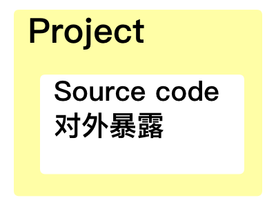
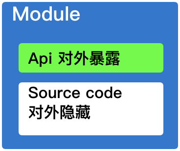
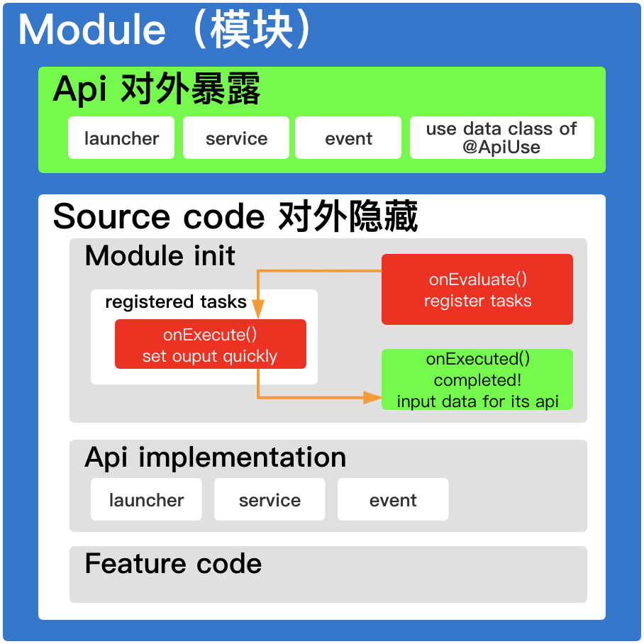
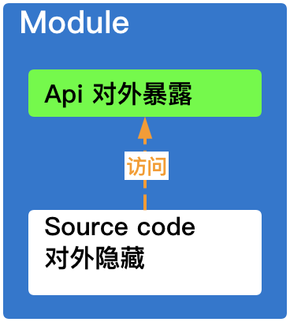
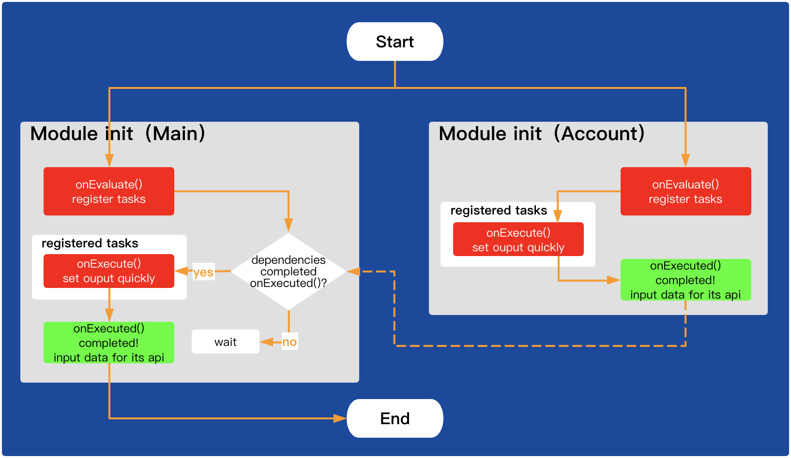
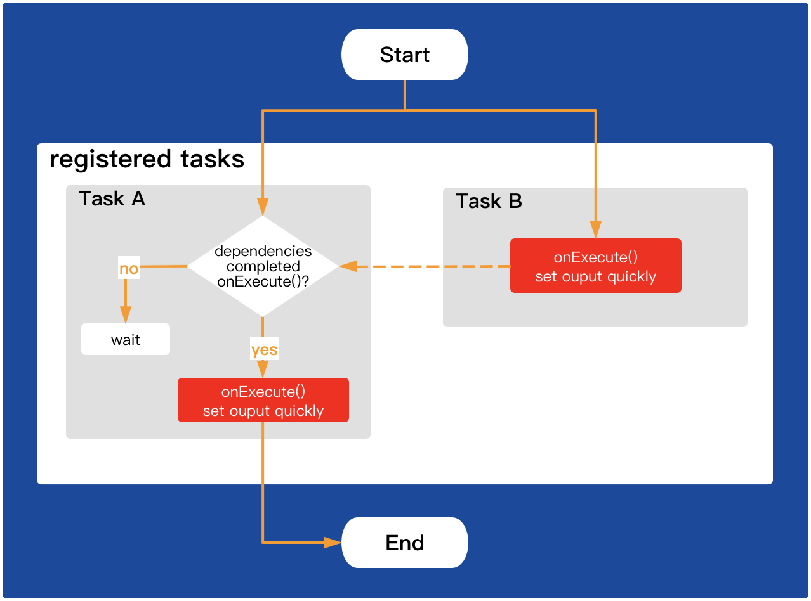

P2M
===
[](https://jitpack.io/#wangdaqi77/P2M) [](https://www.apache.org/licenses/LICENSE-2.0)

一个简单、高效、安全、完整的Android组件化框架库。

支持环境:
 * Kotlin：1.3.20+
 * AGP：3.4.0+
 * Gradle：6.1.1+

阅读本文档时结合[示例工程][example]效果更佳。

P2M是什么？
---------
P2M是完整的组件化工具，它将Project态升级为[Module态](#Module态)。

|Project态|Module态|
|---|---|
|include ':projectPath'|p2m {<br>    module('YourModuleName') {<br>        include(':projectPath')<br>    }<br>}|
|||

使用P2M
-------
P2M支持Module态的[声明](#声明模块)、[声明依赖项](#声明依赖项)、[安全初始化](#Module-init区)、[单独运行](#如何单独运行模块)、[打包到仓库](#如何发布模块到仓库)、[依赖仓库中的模块](#如何依赖仓库中的模块)等主要功能，它将所有的功能集成在`p2m-android`插件中，在`settings.gradle`文件中声明该插件：
```
buildscript {
    repositories {
        google()
        mavenCentral()
        maven { url 'https://jitpack.io' }
    }

    dependencies {
        classpath 'org.jetbrains.kotlin:kotlin-gradle-plugin:1.4.10'    // Kotlin支持1.3.20+
        classpath 'com.android.tools.build:gradle:4.0.2'                // AGP支持3.4.0+
        classpath 'com.github.wangdaqi77.P2M:p2m-plugin:$lastVersion'   // P2M插件
    }
}

// 声明插件
apply plugin: "p2m-android"
```
注意事项：
 * P2M内部使用了Kotlin和APG，如上在`settings.gradle`文件中必须声明Kotlin依赖项和APG依赖项，参考示例中工程中[根目录下的settings.gradle](./example/settings.gradle)；
 * 工程根目录下的`build.gradle`文件中要移除Kotlin依赖项和APG依赖项，参考示例工程中[根目录下的build.gradle](./example/build.gradle)。

声明插件后，使用`p2m { }`配置大多数功能，在`settings.gradle`文件中：
```
...

apply plugin: "p2m-android"

p2m {
    app {                                                   // 声明一个app壳，至少声明一个，可声明多个
        include(":your project path") {                     // 声明project描述
            projectDir = new File("your project path")      // 声明project文件夹路径，如project文件夹路径与settings.gradle同一层级可不用配置
        }
        dependencies {                                      // 声明依赖项，可依赖多个
            module("YourModuleName1")
            module("YourModuleName2")
        }
    }

    module("YourModuleName") {                              // 声明一个模块，驼峰命名，可声明多个
        include(":your project path") {                     // 声明project描述
            projectDir = new File("your project path")      // 声明project文件夹路径，如project文件夹路径与settings.gradle同一层级可不用配置
        }
        dependencies {                                      // 声明依赖项，可依赖多个
            module("YourModuleName1")
            module("YourModuleName2")
        }

        groupId = "com.repo"    // 组，用于发布模块到仓库或者使用仓库中的模块，默认值模块名
        versionName = "0.0.1"   // 版本，用于发布模块到仓库或者使用仓库中的模块，默认值unspecified

        useRepo = false         // 使用已经发布到仓库中的模块，true表示使用仓库，false表示使用源码，默认false。
        runApp = false          // 运行app开关，true表示可以运行app，false表示作为模块，默认值false，applicationId等配置在./your project path/build.gradle中的p2mRunAppBuildGradle{}
    }

    p2mMavenRepository {                    // 声明maven仓库用于发布和获取模块, 默认为mavenLocal()
        url = "your maven repository url"   // 仓库地址
        credentials {                       // 登录信息
            username = "your user name"
            password = "your password"
        }
    }
}
```

注意事项：
 * P2M规定至少声明一个app壳；
 * P2M内部将根据配置对app壳和模块自动引用插件`com.android.application`、`com.android.library`、`kotlin-android`和`kotlin-kapt`，对应目录下的`build.gradle`文件中要移除这些插件声明，参考示例工程中[app壳的build.gradle](./example/app/build.gradle)和示例工程中[Main模块的build.gradle](./example/module-main/build.gradle)；

Module态
--------
一个Module态对应是一个[声明的模块](#声明模块)，模块之间可以[建立依赖关系](#声明依赖项)。

如果有A模块依赖B模块：
 * 对于A来说，B是**依赖项**；
 * 对于B来说，A是**外部模块**；
 * 此时B不能再依赖A了，**模块之间禁止互相依赖**。

一个模块包含一个[Api区](#Api区)和一个[Source code区](#Source-code区)，Api区会暴露给外部模块，Source Code区是对外隐藏的。
<br/><br/><br/>

每个模块还支持：
 * [安全初始化](#Module-init区)
 * [打包到仓库](#如何发布模块到仓库)
 * [依赖仓库中的模块](#如何依赖仓库中的模块)
 * [单独运行](#如何单独运行模块)

### 声明模块
假设有一个工程包含帐号功能和其他的功能，所有的功能都存放一个project中，它的project文件夹名称是`app`，工程的文件结构大致如下：
```
├── app
│   ├── src
│   └── build.gradle
├── build.gradle
└── settings.gradle
```

接下来将帐号功能剥离出来作为单独的模块，并称其为帐号模块，它的project文件夹命名为`module-account`，此时工程的文件结构大致如下：
```
├── app
│   ├── src                                 // app壳
│   └── build.gradle
├── module-account                          // 帐号模块
│   ├── src
│   └── build.gradle
├── build.gradle
└── settings.gradle                         // P2M配置
```

帐号模块在P2M中命名为`Account`，在`settings.gradle`文件中声明：
```
p2m {
    app {                                   // 声明app壳
        include(":app")
    }
    
    module("Account") {                     // 声明模块
        include(":module-account")          // 描述project
    }
}
```

如果`module-account`在更深的文件层级，工程的文件结构大致如下：
```
├── app
├── modules
│   └── module-account                      // 帐号模块
└── settings.gradle
```

此时P2M已经无法识别该模块的具体路径，这需要描述该模块的project文件夹路径，在`settings.gradle`文件中：
```
p2m {
    ...
    
    module("Account") {
        include(":module-account") {
            projectDir = new File("./modules/module-account") // 描述project文件夹路径
        }
    }
}
```

### 声明依赖项
如果`Main`模块使用`Account`模块，因此`Main`需要依赖`Account`，在`settings.gradle`文件中声明：
```
p2m {
    module("Account") {                         // 声明模块
        include(":module-account")              // 声明project
    }

    module("Main") {
        include(":module-main")
        dependencies {                          // 声明依赖项，这里表示Main依赖Account
            module("Account")
        }
    }
}
```

此时`Account`的Api区暴露给了外部模块`Main`：
<br/><br/><br/>

模块也可以使用自身的Api区：
<br/><br/><br/>

app壳也支持声明依赖，在`settings.gradle`文件中：
```
p2m {
    ...
    
    app {                                       // 声明App壳
        include(":app")
        dependencies {                          // 声明依赖项
            module("Main")
            module("Account")
        }
    }
}
```

### Api区
Api区是[模块](#Module态)的一部分，它会暴露给外部模块。

如果把模块比喻成国家，那么Api区就属于外交，因此Api区不能随意暴露一些内容。

P2M限制Api区中只允许提供启动器、服务接口、事件、对外暴露的数据类等内容，它们是根据[Api区相关的注解](#Api区注解)在[编译Api区](#如何编译Api区)后生成。

起初你无需关注会生成的具体内容，你要知道在[编译Api区](#如何编译Api区)后，外部模块可以在代码中访问Api区：
```kotlin
val accountApi = P2M.apiOf(Account::class.java)     // Account的api
val launcher = accountApi.launcher                  // Account中的启动器
val service = accountApi.service                    // Account中的服务
val event = accountApi.event                        // Account中的事件
```
亦可以：
```kotlin
val (launcher, service, event) = P2M.apiOf(Account::class.java)
```

### Api区注解
[Api区](#Api区)主要有三大注解，它们分别是为启动器、服务接口、事件而设计的：
 * [ApiLauncher](#Api区注解之ApiLauncher) - 启动器
 * [ApiService](#Api区注解之ApiService) - 服务接口
 * [ApiEvent](#Api区注解之ApiEvent) - 事件

有时外部模块要使用模块内部的一些数据类，这些类使用`ApiUse`注解在[编译Api区](#如何编译Api区)后，这些类将会放入到Api区中，如：
```kotlin
@ApiUse
data class UserInfo(
    val userId: String,
    val userName: String,
)
```

#### Api区注解之ApiLauncher
`ApiLauncher`是为模块的启动器而设计的，同一模块内可注解多个类，需要指定`launcherName`：
 * 支持注解Activity的子类，将为其生成启动器`val activityOf$launcherName() : ActivityLauncher`;
 * 支持注解Fragment的子类，将为其生成启动器`val fragmentOf$launcherName() : FragmentLauncher`；
 * 支持注解Service的子类，将为其生成启动器`val serviceOf$launcherName() : ServiceLauncher`。

例如，外部模块需要使用`Account`模块的登录界面，首先在`Account`模块声明：
```kotlin
@ApiLauncher(launcherName = "Login")
class LoginActivity: Activity() {
    ...
}
```

在[编译Api区](#如何编译Api区)后，在外部模块启动调用：
```kotlin
P2M.apiOf(Account::class.java)
    .launcher
    .activityOfLogin
    .launch(this)
```
Activity的启动器还[支持ResultApi](#Activity启动器如何支持ResultApi)。

#### Api区注解之ApiService
`ApiService`是为模块的服务接口而设计的，同一模块内只能注解一个类：
 * 被注解类必须是`class`；
 * 被注解类中的所有公开成员方法将会被提取到Api区中。

例如，外部模块需要使用`Account`模块的退出登录功能，首先在`Account`模块声明：
```kotlin
@ApiService
class AccountService {
    fun logout() {              // logout()会被提取到Api区中
        ...
    }
}
```
在[编译Api区](#如何编译Api区)后，在外部模块调用：
```kotlin
P2M.apiOf(Account::class.java)
    .service
    .logout()
```

#### Api区注解之ApiEvent
`ApiEvent`是为模块的事件而设计的，同一模块内只能注解一个类：
 * 被注解类必须是`interface`；
 * 被注解类中所有使用`ApiEventField`注解的成员字段将会转换成[可感知生命周期的可订阅的事件持有类型][live-event]（概况一下就是类似LiveData，但是比LiveData适合事件场景），这些类型用于发送事件和订阅事件。
   * `ApiEventField`需要指定`eventOn`和`mutableFromExternal`，默认为`@ApiEventField(eventOn = EventOn.MAIN, mutableFromExternal = false)`；
     * `eventOn = MAIN`表示在主线程维护和接收事件，`eventOn = BACKGROUND`表示在后台线程维护和接收事件；
     * `mutableFromExternal = false`表示外部模块不可发出事件，为了保证事件的安全性，不推荐外部模块发出事件。
 * 模块内部通过调用`P2M.apiOf(${moduleName}::class.java).event.mutable()`发出事件；

例如，外部模块需要登录成功后进行跳转，因此`Account`模块需要暴露登录成功的事件，且此事件禁止外部模块更改，首先在`Account`模块声明：
```kotlin
@ApiEvent
interface AccountEvent {
    @ApiEventField(eventOn = EventOn.BACKGROUND, mutableFromExternal = false)
    val loginSuccess: Unit
}
```

在[编译Api区](#如何编译Api区)后，在外部模块观察此事件：
```kotlin
P2M.apiOf(Account::class.java)
    .event
    .loginSuccess
    .observeForeverNoSticky(Observer { _ -> // 相比LiveData.observeForever，不会收到粘值
        // 跳转...
    })
```

### Source code区
Source code区是[模块](#Module态)的一部分，它是对外隐藏的，主要有三个部分：
 * [Module init](#Module-init区)          - 模块初始化，由开发者编码完成；
 * Api implementation   - 模块Api区的具体实现，该部分开发者无需感知；
 * Feature code         - 模块内部功能编码区，由开发者编码完成。

### Module init区
Module init区是[Source code区](#Source-code区)的一部分，它是为模块初始化而设计的。

模块初始化需要使用`ModuleInitializer`注解，一个模块内只能有一个类使用这个注解，且该类必须实现`ModuleInit`接口，每个模块必须声明此类。

例如`Account`模块：
```kotlin
@ModuleInitializer
class AccountModuleInit : ModuleInit {
    // 运行在子线程，可以为本模块注册一些任务用于快速加载数据
    override fun onEvaluate(context: Context, taskRegister: TaskRegister) {
        // 用户本地缓存
        val userDiskCache = UserDiskCache(context)
        // 注册读取登录状态的任务
        taskRegister.register(LoadLoginStateTask::class.java, userDiskCache)

        taskRegister.register(ATask::class.java)    // 注册A任务
        taskRegister.register(BTask::class.java)    // 注册B任务
        taskRegister.find(ATask::class.java)        // A任务依赖B任务
            .dependOn(BTask::class.java)
    }

    // 运行在主线程，本模块注册的任务已经执行完毕，这里意味着模块即将完成初始化
    override fun onExecuted(context: Context, taskOutputProvider: TaskOutputProvider) {
        // 获取任务输出-登录状态
        val loginState = taskOutputProvider.outputOf(LoadLoginStateTask::class.java) ?: false
        // 在运行时，Account模块初始化完成后，外部模块才可以使用其Api区，因此在模块初始化时一定要准备好必要的数据或者行为。
        P2M.apiOf(Account::class.java)
            .event
            .mutable()
            .loginState
            .setValue(loginState)
    }
}
```
更多代码也可以参考示例工程中[Account模块的Module init区](./example/module-account/src/main/java/com/p2m/example/account/module_init)。

模块初始化工作有三个阶段：
 * `onEvaluate()` - 评估自身阶段，主要用于注册任务，它运行在后台线程。
 * `onExecute()`  - 执行阶段，当模块依赖项均已完成初始化时触发，将执行注册过的任务，每个任务运行在单独的后台线程。
 * `onExecuted()` - 完成执行阶段，本模块注册的任务已经执行完毕，这里意味着模块即将完成初始化，它运行在主线程。

模块初始化工作有以下定式：
 * 在模块内部，执行顺序一定为`onEvaluate()` > `onExecute()` > `onExecuted()`。
 * 在模块内部，如果任务`A`依赖任务`B`，执行顺序一定为任务B的`onExecute()`> 任务A的`onExecute()`。
 * 如果模块`A`依赖模块`B`，执行顺序一定为模块`B`的`onExecuted()` > 模块A的`onExecute()`。
 * 如果模块`A`依赖模块`B`且模块`B`依赖模块`C`，执行顺序一定为模块`C`的`onExecuted()` > 模块A的`onExecute()`。

当`Main`模块依赖`Account`模块时，模块初始化的运行时流程图：
<br/><br/><br/>

当任务`A`依赖任务`B`，模块内任务的运行时流程图：
<br/><br/><br/>

Q&A
===

如何编译Api区？
-------------
编写代码时，如果[Api区相关注解](#Api区注解)有增删改操作，手动编译后才能暴露Api区的内容：
 * 单个模块：点击Android Studio中的[Build][AS-Build] > Make Module；
 * 所有模块：点击Android Studio中的[Build][AS-Build] > Make Project。

P2M支持增量编译，这大大提高了编译速度。

Activity启动器如何支持ResultApi？
-------------------------------
需要使用相关的注解支持：
 * 使用`@ApiLauncher`为Activity声明Activity启动器，可参考示例工程中[Account模块的ModifyAccountNameActivity](./example/module-account/src/main/java/com/p2m/example/account/pre_api/ModifyAccountNameActivity.kt)；
 * 使用`@ApiLauncherActivityResultContractFor`指定一个ActivityResult合约，该注解的`launcherName`与Activity的`launcherName`一致才能匹配关联到Activity，可参考示例工程中[Account模块的ModifyUserNameActivityResultContract](./example/module-account/src/main/java/com/p2m/example/account/pre_api/ModifyUserNameActivityResultContract.kt)；

在[编译Api区](#如何编译Api区)后外部模块就可以使用了，可参考示例工程中[Main模块的MainActivity](./example/module-main/src/main/java/com/p2m/example/main/pre_api/MainActivity.kt)；：
```kotlin

private val modifyAccountNameLauncherForActivityResult =
    P2M.apiOf(Account::class.java)
        .launcher
        .activityOfModifyAccountName
        .registerForActivityResult(this) { resultCode, output ->
            // 接收到结果...
        }

// 启动界面
modifyAccountNameLauncherForActivityResult.launch(null)
```

如何单独运行模块？
------------
单独运行模块分为三步：
 1. 打开运行开关，在声明模块代码块中增加`runApp = true`和`useRepo = false`，位于工程根目录下的settings.gradle：
    ```groovy
    p2m {
        module("YourModuleName") {
            // ...
            useRepo = false             // 使用已经发布到仓库中的模块，true表示使用仓库，false表示使用源码，默认false
            runApp = true               // 运行app开关，true表示可以运行app，false表示作为模块，默认false
        }
    }
    ```

 2. 声明必要参数，在该模块文件夹下的`build.gradle`声明，参考示例工程中[Main模块的build.gradle](./example/module-main/build.gradle)：
    ```groovy
    // 当`runApp=true`时才会应用这里的配置，必须放置文件的底部，以便覆盖上面的配置。
    p2mRunAppBuildGradle {
        android {
            defaultConfig{
                applicationId "your.application.package"
            }

            sourceSets {
                debug {
                    java.srcDirs += 'src/app/java'                      // 在这里需要自定义Application，用于调用P2M.init()
                    manifest.srcFile 'src/app/AndroidManifest.xml'      // 在这里需要指定自定义的Application，启动界面
                }
            }
        }
    }
    ```

 3. Sync Project

如何发布模块到仓库？
--------------------
发布模块到仓库需要两步完成：
 1. 在声明模块代码块中增加一些配置，位于工程根目录下的`settings.gradle`：
    ```groovy
    p2m {
        module("YourModuleName") {
            // ...
            groupId = "your.repo.groupId"       // 组
            versionName = "0.0.1"               // 版本
            useRepo = false
        }

        p2mMavenRepository {                    // 声明maven仓库
            url = "your maven repository url"   // 仓库地址
            credentials {                       // 仓库的用户认证信息
                username = "your user name"
                password = "your password"
            }
        }
    }
    ```

 2. 执行发布到仓库的命令
    * linux/mac下：
      ```shell
      ./gradlew publish${YourModuleName}      // 用于发布单个模块
      ./gradlew publishAllModule              // 用于发布所有的模块
      ```
    * windows下：
      ```shell
      gradlew.bat publish${YourModuleName}    // 用于发布单个模块
      gradlew.bat publishAllModule            // 用于发布所有的模块
      ```

如何依赖仓库中的模块？
-------------------
前提是已经将模块打包到了仓库中，依赖仓库中的模块需要两步完成：
 1. 在声明模块代码块中增加以下配置，位于工程根目录下的`settings.gradle`：
    ```groovy
    p2m {
        module("YourModuleName") {
            // ...
            groupId = "your.repo.groupId"       // 组
            versionName = "0.0.1"               // 版本
            useRepo = true                      // 使用已经发布到仓库中的模块，true表示使用仓库，false表示使用源码，默认false
        }

        p2mMavenRepository {                    // 声明maven仓库
            url = "your maven repository url"   // 仓库地址
            credentials {                       // 仓库的用户认证信息
                username = "your user name"
                password = "your password"
            }
        }
    }
    ```
 2. Sync Project

混淆
====
```
-keep class * extends com.p2m.core.module.ModuleCollector { <init>(); }
-keep class * extends com.p2m.core.module.Module { <init>(); }
```
因本库内部使用了[可订阅的事件持有对象][live-event]库，因此需要还增加以下配置：
```
-dontwarn androidx.lifecycle.LiveData
-keep class androidx.lifecycle.LiveData { *; }
-dontwarn androidx.lifecycle.LifecycleRegistry
-keep class androidx.lifecycle.LifecycleRegistry { *; }
```

 [AS-Build]: https://developer.android.com/studio/run#reference
 [live-event]: https://github.com/wangdaqi77/live-event
 [example]: https://github.com/wangdaqi77/P2M/tree/master/example
 [LoginUserInfo]: example/module-account/src/main/java/com/p2m/example/account/pre_api/LoginUserInfo.kt
